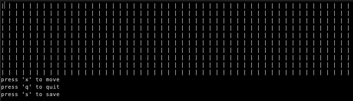

#Tic-tac-toe
> A game in your console.
---
####Rules
Tic-tac-toe is a logical game between two opponents on a square field of N by M cells. One of the players plays with "crosses", the second - with "noes". In this game, you have to defeat a computer. Players take it in turns to place NxM signs on the free cells of the field . The first one to line up min(N, M) of their pieces vertically, horizontally, or diagonally wins. The first move is made by the player.

####Run the game



Run the following command from the root directory to run the game:
```
$ python main.py N M
```
Where **_N_** and **_M_** are arbitrary numbers, if there is a save, the game will offer to load the last saved game

####Keyboard Commands

| Key | Action |
|---|---|
|`→` `←` `↑` `↓`| move
|`s`| save game|
|`x`| make move|
|`q`| quit game|
|`y`| load save|

_Note: you can load the save only during the start, if it is, otherwise the save will lost_

####Requerements

You must have 3.6+

####External libraries
 
-`typer`
-`curses`